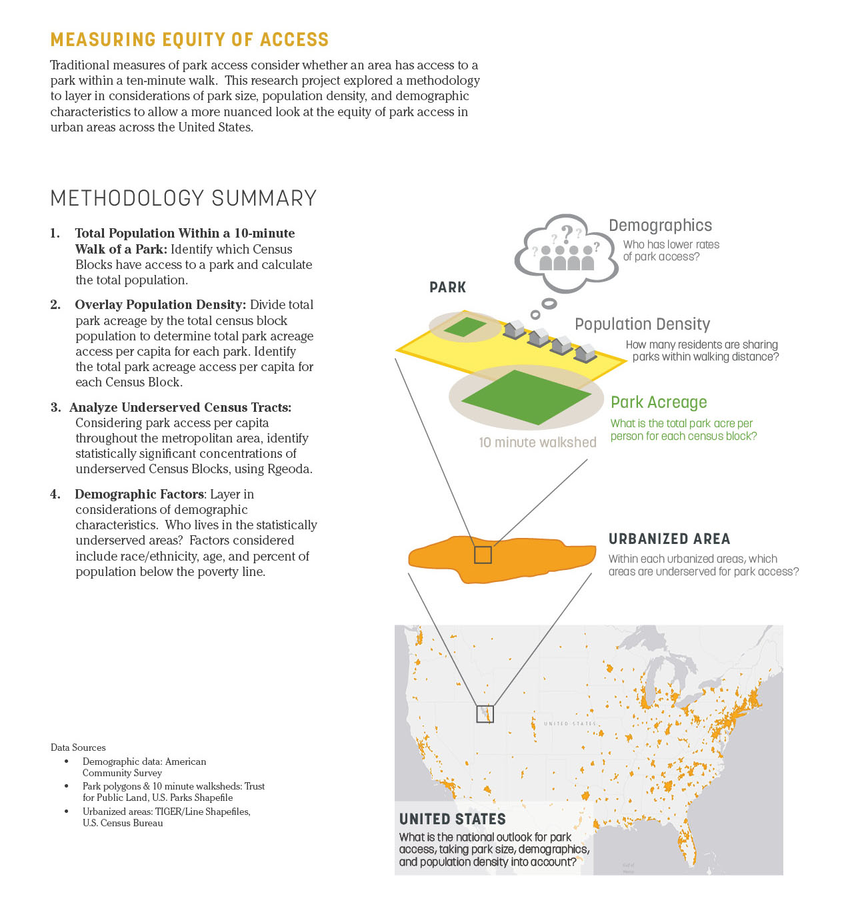
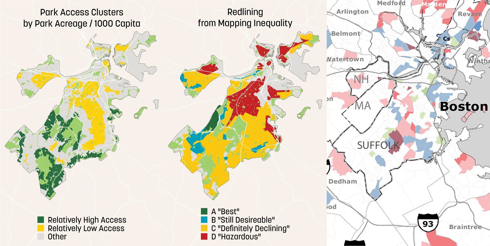

# park-equity-analysis
Using PyQGIS and Rgeoda for Evaluating Localized Equitable Park Access across the United States

## Background
This research project explored a methodology to layer in considerations of park size, population density, and demographic characteristics to allow a more nuanced look at the equity of park access in urbanized areas across the United States. PyQGIS and Rgeoda were used for this analysis to allow for localized analysis at the national scale, as well as to make this analysis available to cities, towns, and researchers who may be interested in replicating the methodology to better measure park equity.

## Motivation
In park system planning, the traditional measure of equitable access to parks has been the 10-minute walk isochrone, determining what percentage of residents live within a short walk of a park. However, these metrics do not capture inequities in park access for different demographic groups, nor do they consider the quality of parks that communities have access to. 

## Methodology
This project’s methodology layers in considerations of park size, population density, and demographic characteristics to allow a more nuanced look at the equity of park access in urbanized areas across the United States. By calculating park acreage per capita for Census Blocks within a park’s 10-minute walk isochrone and adding that up at the Census Block level, univariate and bivariate cluster analysis were performed to determine spatial relationships between park acreage access and demographic characteristics such as race/ethnicity. 

To scale up the analysis to all 487 urbanized areas in the US, the project team looked to using Rgeoda to perform the analysis. GeoDa is an open source spatial statistics platform developed by Dr. Luc Anselin and his team, however it is limited to analyzing data from one spatial file. Rgeoda is a R package for spatial statistics based on libgeoda and GeoDa that was released in 2019 right when this project was launching. The integration of Geoda in R allowed the team to examine equitable park access at a localized level (eg. urbanized areas or cities) but at a national scale by running iterative or batch spatial cluster analysis. 

## Results
The results from the analysis includes spatial clusters identifying Census Blocks with relatively high or low park acreage access. Each of these Census Blocks also have demographic data as attributes (eg. race/ethnicity, age, poverty level), enabling the research team to dive into who is living in these clusters and identifying groups that may be under or over represented as a measure of equity.

## PyQGIS and RGeoda
The codes for this were written sometime in 2018 and may be outdated given that RGeoda has had a lot of updates since. We aren't actively updating the code, but would love to hear from you if you end up using it!

SummarizeLocation_Step2.py
This is the PyQGIS script used for step 2: calculating park acreage/1000 capita.

RGeoda_LocalMoran_ParkEquity.R
This is the R script using RGeoda to run the Univariate Local Moran's I analysis to determine low/high park access areas and generate summary statistics.
